# Discussion Of Problem And Deduction Of Algorithm

## General Considerations

The problem that needs to be solved is calculating heat waves based on
the [KNMI definition](https://www.knmi.nl/kennis-en-datacentrum/uitleg/hittegolf):
> In the Netherlands, a heat wave is a succession of at least 5 summer days (maximum temperature 25.0 °C or higher)  in
> De Bilt, of which at least three are tropical days (maximum temperature 30.0 °C or higher).

As there's a follow-up requirement to extend the application to calculate cold waves
their [KNMI definition](https://www.knmi.nl/kennis-en-datacentrum/uitleg/koudegolf) in mind:
> According to the KNMI definition, a cold wave is a continuous period in De Bilt of at least 5 ice days (maximum
> temperature lower than 0.0 degrees). Of these, the minimum temperature is lower than minus 10.0 degrees (severe frost)
> on at least 3 days.

For the discussion, we start out with developing a heat wave-specific algorithm and see if it can be generalized.

## Input Data

The input data are batches of a timeseries in which each record has temperature reading fields. Conceptually, the
relevant input data has the form as depicted in table below.

| Date       | Temperature |
|------------|-------------|
| 2004-06-01 | 21          |
| 2004-06-02 | 24          |
| 2004-06-03 | 22          |
| 2004-06-04 | 25          |
| 2004-06-05 | 26          |
| 2004-06-06 | 30          |
| 2004-06-07 | 30          |
| 2004-06-08 | 25          |
| 2004-06-09 | 31          |
| 2004-06-10 | 25          |
| 2004-06-11 | 22          |
| 2004-06-12 | 21          |

In this timeseries, we need to identify:

1. a sequence of at least 5 consecutive days[^consecutive_days] representing consecutive dates with a maximum
   temperature of at least 25 degree, and
2. within this sequence, the presence of at least 3 records with a temperature of at least 30 degree.

[^consecutive_days]: Point 1 also implies that the data need to be checked for days not represented in the data.

## Deduction Of Algorithm

An expected example output of the algorithm is shown below.

| From date   | To date (inc.) | Duration (in days) | Number of tropical days | Max temperature |
|-------------|----------------|--------------------|-------------------------|-----------------|
| 31 jul 2003 | 13 aug 2003    | 14                 | 7                       | 35.0            |

Based on that, the algorithm needs to keep track of the following fields:

1. Start date
2. End date
3. Number of days
4. Number of tropical days (days with a maximum temperatures of at least 30 degrees)
5. Maximum temperature in the sequence

### An Array-Based Algorithm

Let the input be an array of the dates and an array of the temperatures in which `dates[i]` corresponds
to `temperatures[i]`. By keeping track of the aforementioned fields, heat waves in the input data can be identified in a
single pass over the temperatures array with linear time complexity and linear space complexity (depending on the input
array length).

https://github.com/MichaelHeinecke/heatwave/blob/acb4d0fdb5b4cb1f4f961625fd9da67585c23e97/algorithms/src/algorithms/array_based_algorithm.py#L43-L79

[Here](./src/algorithms/array_based_algorithm.py) is the full implementation.

#### Extensibility To Cold Waves

By adding two fields

1. Number of ice days (maximum temperatures less than 0 degrees)
2. Number of severe frost days (minimum temperature less than -10 degrees)

and adding equivalent logic to check for cold waves, the algorithm could be applied to calculate cold waves as well.

#### Horizontal Scalability

Scaling the algorithm horizontally is a little trickier. To process data in parallel on multiple machines, the input
data has to be split and sent to other machines. If the data is split arbitrarily, data for a single heatwave might be
sent to separate machines, in which case the heat wave cannot be calculated, would be calculated as two separate ones,
or would be calculated but not in its full length.

The data would have to be partitioned appropriately to ensure that heat wave data aren't cut in the middle, before the
data are sent to separate workers.

#### Issue With Processing New Batches Of Data

The data comes in monthly batches. A heat wave might start in month n and continue in month n + 1. Hence, processing new
batches of data comes with an issue similar to the one described in the section
on [Horizontal Scalability](#horizontal-scalability).

Damn you, batch processing! :D

There are at least two possible solutions:

1. The brute force approach: Reprocess everything. Simple but not efficient.
2. Reprocess parts of the data of month n (possibly relevant records identified by their temperature) when processing
   data of month n + 1. The data of month n could be filtered appropriately when processing data for month n + 1, or the
   potentially relevant records could be written to a dedicated location when processing data for month n and read them
   from there when processing data for month n + 1.

### Using A Higher Level Of Abstraction - A Window Function-Based Algorithm

### Using A Higher Level Of Abstraction & Streaming

In the interest of time and as stream processing isn't warranted by the input data arriving in monthly batches, the
possible options are only briefly touched on without developing an algorithm.

#### Complex Event Processing

The basic concept of Complex Event Processing (CEP) is that pre-defined patterns are searched in a stream of events as
they arrive.

```mermaid
flowchart TB
   Pattern --> Stream
   subgraph Pattern
      sequence["🌞🔥🌞🔥🌞"]
   end
   subgraph Stream
      events["🥶🥶🌤️🌤️🌤️🌞🌞🔥🔥🌞🔥🌞🔥🌞🌤️🌤️🌤️🌤️🌤️🥶🥶🥶"]
   end
```

This approach could be used to match heat/cold wave patterns on a stream of temperature reading events. An
implementation could be done with the
library [FlinkCEP](https://nightlies.apache.org/flink/flink-docs-master/docs/libs/cep/)

#### Stream Processing

It should be possible to create a stateful streaming application using the general idea of
the [array-based algorithm](#an-array-based-algorithm) with one of the many stream processing libraries.
